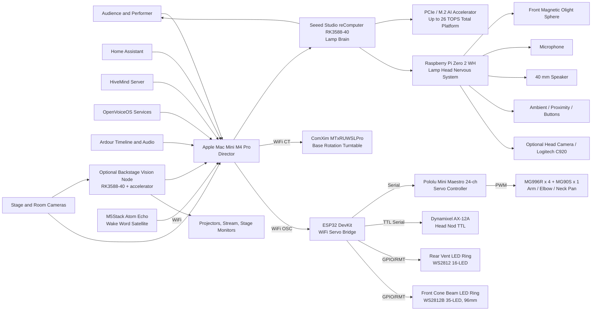

# PIXSTARS Architecture

> Master architecture document for the PIXSTARS animatronic lamp platform.
> Language policy: **English only** across architecture, diagrams, labels, and future technical documentation.

## Design Principle

PIXSTARS is designed around a simple theatrical rule:

> **The lamp is a character, not a prop.**

The architecture therefore separates the system into three roles:

- **Director** - backstage orchestration on the Apple Mac Mini M4 Pro
- **Brain** - local AI execution in the lamp base on the Seeed Studio reComputer RK3588-40
- **Nervous System** - local I/O and device control in the lamp head on the Raspberry Pi Zero 2 WH

A fourth layer - the **Motion Substrate** - sits beneath the lamp in the cave under the ComXim turntable and handles all physical actuation (servos, base rotation, LED ring drive). It is intentionally dumb: it executes commands; it does not decide. See `architecture_decision_records/LAMP_ARCHITECTURE_v3.md` for the v3 cave design.

## High-Level Relationship Map

## System Roles

| Layer | Device | Physical Location | Main Role |
|---|---|---|---|
| Backstage Core | Apple Mac Mini M4 Pro | Backstage rack / control desk | Show direction, timeline, orchestration, projections, global state |
| Lamp Brain | Seeed Studio reComputer RK3588-40 | Lamp base | Local AI, speech, vision, behaviour, HiveMind client |
| Lamp Accelerator | PCIe / M.2 AI accelerator | Lamp base | Extra AI throughput for heavier local inference |
| Lamp Head Controller | Raspberry Pi Zero 2 WH | Lamp head | Audio I/O, sensor polling, heartbeat, local device control |
| Base Rotation Engine | ComXim MTxRUWSLPro turntable | Under lamp (riser block) | Precision base rotation, WiFi CT protocol, direct from Mac Mini |
| Servo Bridge | ESP32 DevKit | Cave (under turntable) | WiFi receiver for servo commands, drives Maestro, AX-12A, and LED ring |
| Servo Controller | Pololu Mini Maestro 24-ch | Cave (under turntable) | PWM hub for arm, elbow, neck pan servos |
| Head Nod Actuator | Dynamixel AX-12A | Lamp head | Head nod via TTL serial from ESP32 (not on Maestro) |
| LED Ring Driver | ESP32 DevKit GPIO (RMT) | Cave (under turntable) | WS2812 5050 RGB LED Ring 16 driven via cable column to lamp head |
| Front Cone Beam LED Ring | WS2812B 35-LED Pixel Ring (96mm Ø) | Inside lampshade, around Olight Sphere C | Forward-projecting cone beam, stage-light effect, halo around Olight eye |
| Lamp Head Projector | RGB Laser Galvo Scanner (Opt Lasers 300mW Micro RGB module with LPLDD-1A-16V-3CH driver, analog 0-5V modulation per channel) | Lamp head (lower interior) | Vector laser with galvo mirrors for theatrical projection, controlled via ILDA DAC in cave |
| Optional Vision Node | RK3588-40 plus accelerator | Backstage | Multi-camera analysis, audience tracking, offloaded vision AI |
| Wake Word Satellite | M5Stack Atom Echo | Backstage or near lamp | Optional dedicated wake word listener ("Hey A.I."), backup mic input, development testing |

## Lamp Head Layout

The lamp head contains the hardware that benefits most from short cable runs, plus the head nod actuator:

- **Raspberry Pi Zero 2 WH** mounted inside the head as the local device controller
- **Rear LED ring** (WS2812 5050 RGB LED Ring 16) mounted so it shines **towards the rear air vents** - physically in the head, but data and 5V power are routed from the ESP32 and MEAN WELL PSU in the cave through the cable column (GPIO/RMT single-wire)
- **Front cone beam LED ring** (WS2812B 35-LED Pixel Ring, 96mm outer diameter) mounted inside the lampshade around the Olight Sphere C to create a **forward-projecting cone beam effect**. The Olight serves as the visible "eye" from the side, while the ring provides the directional stage-light cone from the front. Data and 5V power are routed from the ESP32 and MEAN WELL PSU in the cave through the cable column (GPIO/RMT single-wire), same as the rear ring
- **Front-facing magnetic Olight Sphere** used as the **bulb replacement**, attached magnetically inside the shade and facing forward
- **RGB Laser Galvo Scanner** - vector laser projector (Opt Lasers 300mW Micro RGB module with LPLDD-1A-16V-3CH driver, analog 0-5V modulation per channel, plus X/Y galvo mirrors), mounted in the lower interior of the shade below the raised Olight and projecting along the eye-line. Analog X/Y signals (+/-5V) and RGB modulation (0-5V) are routed through the cable column to the ILDA DAC in the cave; galvo driver board is powered from a dedicated +/-15V PSU in the cave, and the LPLDD-1A-16V-3CH laser diode driver is powered from a separate 12V PSU (MEAN WELL LRS-35-12 or equivalent) in the cave
- **40 mm speaker**
- **Microphone**
- **Ambient and proximity sensing**
- **Dynamixel AX-12A** - head nod servo, TTL serial daisy-chain back to the ESP32 in the cave
- **Logitech C920 webcam** - mounted on/near the lamp, role per screenplay

An **M5Stack Atom Echo** serves as an optional dedicated wake word satellite. It contains an ESP32, microphone, WiFi, and a small speaker. During development it provides a standalone "Hey A.I." listener for testing the AI interaction pipeline before the full lamp is assembled. In performance it can serve as a backup microphone input path. It connects to the Mac Mini via WiFi and forwards detected wake words to OpenVoiceOS / HiveMind. See ears/WAKE_WORD_SATELLITE_SETUP.md for setup details.

### Lamp Head Responsibilities

The Raspberry Pi Zero 2 WH is intentionally not the main AI computer. It is the lamp head's **nervous system** and is responsible for:

- microphone and speaker handling
- sensor polling
- front bulb state signalling if integrated later
- diagnostics and heartbeat monitoring
- optional camera capture relay

The Pi does **not** drive any servos and does **not** drive the rear LED ring in v3 - servo and LED responsibilities live in the cave Motion Substrate (ESP32 + Maestro + AX-12A). The Pi handles audio I/O, sensors, and heartbeat only.

### Front-facing Olight Sphere C Integration

The front-facing Olight Sphere C is a self-contained battery-powered BLE Mesh light. It cannot be driven directly by GPIO, serial, or WiFi -- it uses Bluetooth SIG Mesh as its only control transport. To bring it under show control, an **Olight Obounds Smart Wireless Gateway** bridges BLE Mesh to WiFi, enabling Home Assistant control.

The integration path is:

Mac Mini -> Home Assistant -> tuya-local integration -> WiFi -> Obounds gateway -> BLE Mesh -> Sphere C

This allows programmatic on/off, color, and brightness control per show cue. The Obounds gateway sits backstage, plugged into power and connected to the 2.4G WiFi network.

Operational notes:

- The Sphere C must be pre-charged via USB-C before each show (~2h charge, 4-40h runtime depending on mode)
- Sleep mode should be disabled in the Olight app to prevent BLE disconnection during the show
- The Sphere C has its own internal 700mAh battery (USB-C rechargeable); it is not fed from the cave PSU
- The Obounds gateway needs a USB power source backstage

References:

- Home Assistant community guide: https://community.home-assistant.io/t/integrating-olight-spheres-in-ha/907929
- Obounds user manual: docs/olight/OLIGHT-OBOUNDS-UserManual.pdf
- Video walkthrough: https://youtu.be/iRx4gJucEPI?si=fNBU-3CUkbJNBtOu

## Lamp Base Layout

The lamp base contains the parts that need power, cooling, and expansion capacity:

- **Seeed Studio reComputer RK3588-40**
- **PCIe / M.2 AI accelerator**
- power conversion and distribution
- optional audio amplifier and USB peripherals
- local storage and service containers

### Lamp Base Responsibilities

The RK3588-40 is the lamp's **brain** and is responsible for:

- wake word detection
- speech-to-text
- text-to-speech
- local LLM / dialogue logic
- computer vision
- face and gesture understanding
- emotional state engine
- HiveMind client logic
- autonomous behaviour execution

The PCIe / M.2 AI accelerator is reserved for higher-throughput local AI tasks, including:

- multi-model vision inference
- object and person detection
- pose and gesture estimation
- accelerated multimodal pipelines
- future higher-density local reasoning

## Motion Substrate (Cave Architecture v3)

All physical actuation lives below the lamp, hidden inside a "cave" under the ComXim turntable on a riser block. The lamp itself contains only the head nod servo (AX-12A), the WS2812 5050 RGB LED Ring 16, and the Pi-side sensors and audio. The RK3588-40 issues high-level intent (e.g. "turn 30 degrees CW", "raise lower arm to 60%"); the Motion Substrate executes it.

The split of responsibility is:

- **RK3588-40 (Lamp Brain)** - decides what the lamp should do
- **ESP32 / Maestro / AX-12A** - executes arm, elbow, neck pan, head nod, and WS2812 LED ring drive (GPIO/RMT)
- **ComXim MTxRUWSLPro** - executes base rotation

### Cave inventory (under turntable, on servo rail)

- **ESP32 DevKit** - WiFi bridge from Mac Mini / RK3588-40, drives Maestro, AX-12A, and the WS2812 LED ring (GPIO/RMT single-wire to head)
- **Pololu Mini Maestro 24-channel** - serial from ESP32
- **4x MG996R** servos - lower arm (Ch1), elbow (Ch2), spare (Ch3 / Ch4)
- **1x MG90S** servo - neck pan (Ch3), carbon fibre push-pull rod to lamp head
- **MEAN WELL LRS-50-5** power supply - 5V rail for the MG996R / MG90S servos and the WS2812 LED ring (delivered to the head via the cable column), kept separate from logic

### Base rotation engine

- **ComXim MTxRUWSLPro** programmable turntable - precision base rotation (0.1 degree minimum step), WiFi CT command protocol, controlled **directly from the Mac Mini, not via the ESP32**
- **Riser block** (120-150mm aluminium or plywood) - creates the cave depth; ComXim mounts on top
- Maestro **Channel 0 is freed** in v3 (formerly the NEMA 17 stepper in v2)

### Servo channel map (v3)

| Maestro Channel | Joint | Servo | Notes |
|---|---|---|---|
| 0 | (spare) | - | Freed in v3 - stepper removed |
| 1 | Lower arm raise / lower | MG996R | PWM |
| 2 | Upper arm reach (elbow) | MG996R | PWM |
| 3 | Neck pan (push-pull rod) | MG90S | PWM |
| 4 | (spare) | - | PWM |
| 5 | (spare) | - | LED ring is driven from ESP32 GPIO/RMT, not from Maestro |
| - | Head nod | AX-12A TTL ID=1 | Direct TTL from ESP32, not on Maestro |
| - | Base rotation | ComXim turntable | WiFi CT, direct from Mac Mini |

## Backstage Core

The Apple Mac Mini M4 Pro is the **director** of the wider environment and coordinates:

- Ardour timeline and audio playback (Pianoteq 9, MODO DRUM)
- HiveMind server services
- OpenVoiceOS services as required
- Home Assistant automations
- projections and visual outputs
- live streaming and capture
- show state, cues, and global orchestration
- **direct WiFi CT commands to the ComXim turntable** for base rotation
- **WiFi OSC / control channel to the ESP32** for servo, head nod, and LED ring commands

## Optional Backstage Vision Node

An optional second RK3588-40 can be installed backstage for heavy visual workloads:

- audience tracking
- stage camera fusion
- person detection
- applause or engagement analysis
- offloading multi-camera processing from the lamp

## Connections and Protocols

| From | To | Medium | Protocol / Interface | Purpose |
|---|---|---|---|---|
| Mac Mini | Lamp Brain (RK3588-40) | Wi-Fi 6 or wired Ethernet | MQTT, WebSocket, REST, HiveMind | Show control, state sync, commands |
| Mac Mini | ComXim turntable | WiFi (802.11) | CT command protocol (TCP) | Base rotation - precision stepping, origin return |
| Mac Mini | ESP32 (cave) | WiFi (802.11) | OSC / lightweight control | Servo, head nod, and LED ring commands |
| M5Stack Atom Echo | Mac Mini | WiFi (802.11) | HTTP / WebSocket | Wake word detection, voice capture, backup mic input |
| Lamp Brain | Lamp Head Pi | Internal harness | USB 2.0, UART, optional I2C | Audio relay, sensor telemetry, optional camera relay |
| ESP32 | Pololu Mini Maestro | Cave harness | Serial (UART) | PWM channel commands for arm / elbow / neck pan |
| ESP32 | Dynamixel AX-12A | Cable column to lamp head | TTL half-duplex serial | Head nod position commands - NOT on Maestro |
| ESP32 | Rear WS2812 5050 RGB LED Ring 16 | Cable column to lamp head | GPIO / RMT single-wire (WS2812 protocol) | Rear vent lighting effects - data from ESP32, 5V power from MEAN WELL PSU |
| ESP32 | Front WS2812B 35-LED Pixel Ring (96mm) | Cable column to lamp head | GPIO / RMT single-wire (WS2812 protocol) | Forward cone beam / stage-light halo around Olight Sphere C - independent GPIO from rear ring, 5V power from MEAN WELL PSU |
| Maestro Ch1-3 | MG996R / MG90S servos | Cave harness | PWM | Arm, elbow, neck pan actuation |
| Pi Zero 2 WH | Front Olight Sphere | Physical placement only by default | Magnetic mount, optional app control | Forward-facing practical light / bulb replacement |
| Obounds Gateway | Olight Sphere C | Backstage WiFi / BLE Mesh | Bluetooth SIG Mesh | Front light on/off, color, brightness cues |
| Pi Zero 2 WH | Speaker | Local wiring | I2S / USB audio / amplifier path | Voice and sound output |
| Pi Zero 2 WH | Microphone | Local wiring | USB or I2S audio | Performer and audience input |
| Pi Zero 2 WH | Sensors | Local wiring | GPIO / I2C / ADC bridge | Ambient and proximity awareness |
| Pi Zero 2 WH | (no video projector) | n/a | n/a | Pi no longer drives a video projector; laser projection is vector-driven from the ILDA DAC in the cave |
| MEAN WELL LRS-50-5 | Galvo driver board (+/-15V PSU in cave) | Cave harness | DC +/-15V via dedicated galvo PSU | Galvo scanner driver power |
| MEAN WELL LRS-35-12 | Opt Lasers LPLDD-1A-16V-3CH driver | Cave harness | DC 12V via dedicated laser driver PSU | Powers the laser diode driver feeding the Opt Lasers 300mW Micro RGB module |
| Stage Cameras | Vision Node / Director | Backstage network | USB, RTSP, Ethernet | Visual analysis and capture |
| RK3588-40 | AI accelerator | Internal high-speed expansion | PCIe / M.2 | Extra local AI throughput |

## Power Architecture

The preferred power layout is:

1. **AC mains** into the lamp base and into the ComXim turntable (independent feed)
2. **Internal PSU** in the lamp base
3. **MEAN WELL LRS-50-5** in the cave - dedicated 5V rail for the MG996R / MG90S servos, AX-12A, and the WS2812 LED ring (data and 5V routed to the head via the cable column), kept separate from logic
4. **12 V rail** for amplifiers, lighting support, and motor domains where needed
5. **5 V rail** for RK3588-40, Raspberry Pi Zero 2 WH, ESP32, USB peripherals, and logic devices
6. **Separate charging model for the Olight Sphere**, because the sphere is magnet-mounted and normally battery-powered unless later modified for wired power. The **Olight Sphere C** has its own internal 700mAh battery (USB-C rechargeable) and must be pre-charged before each show
7. The **ComXim turntable** has its own internal power and AC inlet - it is not fed from the cave PSU
8. The **Olight Obounds gateway** needs a USB power source backstage (separate from the cave PSU and the lamp base)

## RK3588-40 and RK3576-20 Reference Comparison

| Attribute | RK3588-40 | RK3576-20 |
|---|---|---|
| CPU | 4 x Cortex-A76 + 4 x Cortex-A55 | 4 x Cortex-A72 + 4 x Cortex-A53 |
| GPU | Mali-G610 MC4 | Mali-G52 MC3 |
| NPU | 6 TOPS | 6 TOPS |
| RAM on standard Seeed SKU | 16 GB LPDDR5 | 4 GB LPDDR5 |
| Max memory on family / custom options | Up to 32 GB LPDDR5 | Up to 16 GB LPDDR5 |
| PCIe AI expansion | Yes, platform expandable to 26 TOPS total | Yes, platform expandable to 26 TOPS total |
| Networking on Seeed box | 2 x 2.5GbE | 2 x GbE |
| Fit for PIXSTARS direction | Preferred full AI brain - **confirmed** | Smaller / lower-cost alternative |

## Implementation Notes

- The **rear LED ring** is not the main bulb. It is an expressive lighting element that projects through the rear head vents and is driven from the ESP32 in the cave via GPIO/RMT through the cable column. Its 5V supply is taken from the MEAN WELL LRS-50-5 PSU in the cave.
- The **front-facing Olight Sphere** is the practical light replacing the original front bulb position and is magnetically attached inside the lampshade.
- The Raspberry Pi in the head keeps audio and sensor wiring short. It does not drive servos or the rear LED ring in v3.
- The RK3588-40 and accelerator stay in the base where cooling, power, and expansion are easier.
- The optional backstage vision node should mirror the same software stack where possible to reduce operational complexity.
- The **ComXim turntable is a first-class network device**: it is addressed directly from the Mac Mini over WiFi and is decoupled from the ESP32 / Maestro chain. Losing the ESP32 does not lose base rotation, and vice versa.

## Related Architecture Documents

- `architecture_decision_records/LAMP_ARCHITECTURE_v3.md` - authoritative v3 cave architecture: ComXim turntable as rotation engine, riser block geometry, cave servo rail inventory, control chain, BOM delta from v2, and servo channel map. **This document supersedes any earlier servo / rotation description in the architecture.**
- `architecture_decision_records/LAMP_ARCHITECTURE_v2.md` - prior v2 cave architecture (custom lazy Susan + NEMA 17), retained for migration context only.

## Related Documents

- `docs/audio/AUDIO_SETUP.md`
- `docs/architecture/diagrams/pixstars-architecture-v2.svg`
- `docs/architecture/diagrams/pixstars-architecture-v2-preview.png`
