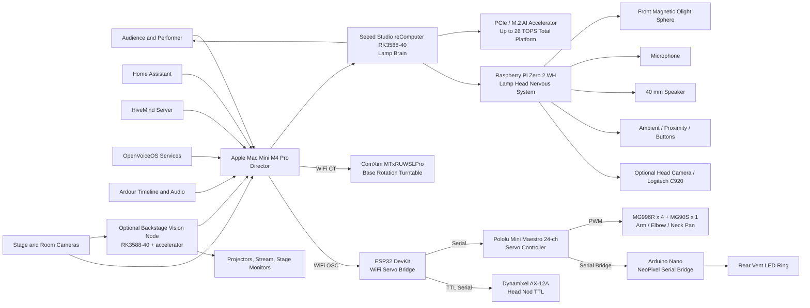

# PIXSTARS Architecture

> Master architecture document for the PIXSTARS animatronic lamp platform.
> Language policy: **English only** across architecture, diagrams, labels, and future technical documentation.

## Design Principle

PIXSTARS is designed around a simple theatrical rule:

> **The lamp is a character, not a prop.**

The architecture therefore separates the system into three roles:

- **Director** - backstage orchestration on the Apple Mac Mini M4 Pro
- **Brain** - local AI execution in the lamp base on the Seeed Studio reComputer RK3588-40
- **Nervous System** - local I/O and device control in the lamp head on the Raspberry Pi Zero 2 WH

A fourth layer - the **Motion Substrate** - sits beneath the lamp in the cave under the ComXim turntable and handles all physical actuation (servos, base rotation, LED ring drive). It is intentionally dumb: it executes commands; it does not decide. See `architecture_decision_records/LAMP_ARCHITECTURE_v3.md` for the v3 cave design.

## High-Level Relationship Map

## System Roles

| Layer | Device | Physical Location | Main Role |
|---|---|---|---|
| Backstage Core | Apple Mac Mini M4 Pro | Backstage rack / control desk | Show direction, timeline, orchestration, projections, global state |
| Lamp Brain | Seeed Studio reComputer RK3588-40 | Lamp base | Local AI, speech, vision, behaviour, HiveMind client |
| Lamp Accelerator | PCIe / M.2 AI accelerator | Lamp base | Extra AI throughput for heavier local inference |
| Lamp Head Controller | Raspberry Pi Zero 2 WH | Lamp head | Audio I/O, sensor polling, LED state signalling, local device control |
| Base Rotation Engine | ComXim MTxRUWSLPro turntable | Under lamp (riser block) | Precision base rotation, WiFi CT protocol, direct from Mac Mini |
| Servo Bridge | ESP32 DevKit | Cave (under turntable) | WiFi receiver for servo commands, drives Maestro and AX-12A |
| Servo Controller | Pololu Mini Maestro 24-ch | Cave (under turntable) | PWM hub for arm, elbow, neck pan servos and NeoPixel bridge |
| Head Nod Actuator | Dynamixel AX-12A | Lamp head | Head nod via TTL serial from ESP32 (not on Maestro) |
| LED Ring Driver | Arduino Nano | Cave (under turntable) | NeoPixel RGBW serial bridge from Maestro Ch5 |
| Optional Vision Node | RK3588-40 plus accelerator | Backstage | Multi-camera analysis, audience tracking, offloaded vision AI |

## Lamp Head Layout

The lamp head contains the hardware that benefits most from short cable runs, plus the head nod actuator:

- **Raspberry Pi Zero 2 WH** mounted inside the head as the local device controller
- **Rear LED ring** (NeoPixel RGBW) mounted so it shines **towards the rear air vents** - driven by the Arduino Nano in the cave via the central cable column
- **Front-facing magnetic Olight Sphere** used as the **bulb replacement**, attached magnetically inside the shade and facing forward
- **40 mm speaker**
- **Microphone**
- **Ambient and proximity sensing**
- **Dynamixel AX-12A** - head nod servo, TTL serial daisy-chain back to the ESP32 in the cave
- **Logitech C920 webcam** - mounted on/near the lamp, role per screenplay

### Lamp Head Responsibilities

The Raspberry Pi Zero 2 WH is intentionally not the main AI computer. It is the lamp head's **nervous system** and is responsible for:

- microphone and speaker handling
- sensor polling
- front bulb state signalling if integrated later
- diagnostics and heartbeat monitoring
- optional camera capture relay

The Pi does **not** drive the rear LED ring or any servos in v3. Those responsibilities live in the cave Motion Substrate (Arduino Nano + Maestro + AX-12A).

## Lamp Base Layout

The lamp base contains the parts that need power, cooling, and expansion capacity:

- **Seeed Studio reComputer RK3588-40**
- **PCIe / M.2 AI accelerator**
- power conversion and distribution
- optional audio amplifier and USB peripherals
- local storage and service containers

### Lamp Base Responsibilities

The RK3588-40 is the lamp's **brain** and is responsible for:

- wake word detection
- speech-to-text
- text-to-speech
- local LLM / dialogue logic
- computer vision
- face and gesture understanding
- emotional state engine
- HiveMind client logic
- autonomous behaviour execution

The PCIe / M.2 AI accelerator is reserved for higher-throughput local AI tasks, including:

- multi-model vision inference
