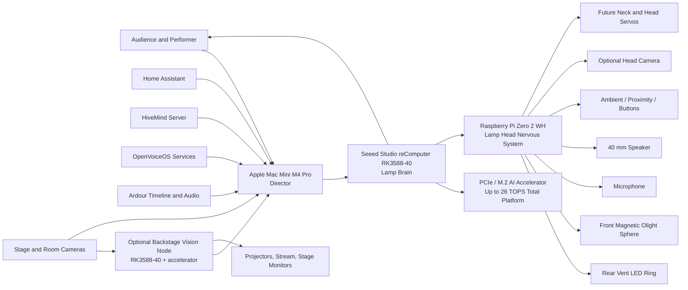

# PIXSTARS Architecture Deliverables

## Executive summary

I recreated the PIXSTARS architecture around the **Seeed Studio reComputer RK3588-40** as the lamp’s main AI computer, with an internal **PCIe / M.2 AI accelerator path** to raise total platform AI performance to **up to 26 TOPS**, a **Raspberry Pi Zero 2 WH** located in the **lamp head** for local I/O and control, and the **Apple Mac Mini M4 Pro** as the backstage “director”. The updated design explicitly models the **rear-facing LED ring** shining into the lamp’s rear vents and the **front-facing magnetic Olight Sphere** acting as the lamp’s bulb replacement. This split matches the capabilities of the hardware: Seeed positions the RK3588-40 as a 6 TOPS, LPDDR5, M.2 / PCIe-expandable AI box with 2×2.5GbE, while Rockchip’s own material shows the stronger RK3588 CPU/GPU complex compared with RK3576. Raspberry Pi’s official material confirms the Zero 2 W family is compact, quad-core, and CSI-capable, which makes it a sensible head-local controller rather than the lamp’s main AI brain. Olight’s official material confirms the Sphere’s 360° light emission and magnetic base, which supports your forward-facing magnetic bulb-replacement design. citeturn2view0turn2view1turn3view0turn4search2turn4search3turn5search0turn5search5turn2view2

The repository paths I recommend are:

```text
docs/architecture/ARCHITECTURE.md
docs/architecture/diagrams/pixstars-architecture-v2.svg
docs/architecture/diagrams/pixstars-architecture-v2-preview.png
```

The generated sandbox files currently available for download are:

- [pixstars-architecture-v2.svg](sandbox:/mnt/data/pixstars-architecture-v2.svg)
- [pixstars-architecture-v2-preview.png](sandbox:/mnt/data/pixstars-architecture-v2-preview.png)

A fresh final sandbox copy of `ARCHITECTURE.md` was not persisted during this finalisation step, so the **authoritative final Markdown is provided inline below** and should be saved to `docs/architecture/ARCHITECTURE.md` or `/mnt/data/docs/architecture/ARCHITECTURE.md`. A previously created sandbox `ARCHITECTURE.md` from an earlier iteration may exist, but it should not be treated as authoritative unless replaced with the content below.

## Validated design choices

The key hardware choice is well supported by primary sources. Seeed’s RK3588-40 product page lists **6 TOPS NPU**, **LPDDR5 up to 32 GB**, **expandable to 26 TOPS via PCIe**, **M.2 for SSD and AI acceleration**, **2×2.5GbE**, **8K@60 decode**, and **8K@30 encode**. The RK3576-20 keeps the same 6 TOPS class NPU and the same “expandable to 26 TOPS via PCIe” proposition, but Seeed’s standard SKU is lower on RAM and networking, and the family tops out lower on memory in Seeed’s own launch article. Rockchip’s official pages show the RK3588 using **4× Cortex-A76 + 4× Cortex-A55** and **Mali-G610 MC4**, while RK3576 uses **4× Cortex-A72 + 4× Cortex-A53** and **Mali-G52 MC3**. That directly supports making the RK3588-40 the lamp-base “brain” and keeping RK3576 only as the smaller alternative in the comparison table. citeturn2view0turn2view1turn3view0turn4search2turn4search3

The Raspberry Pi Zero 2 W / WH remains a good fit for the lamp head because Raspberry Pi’s official material describes a **quad-core 64-bit Cortex-A53 at 1 GHz**, **512 MB SDRAM**, **65 × 30 mm** form factor, wireless connectivity, and a **CSI-2 camera connector**. That is precisely the profile needed for short-run head-local control of microphone, speaker, LEDs, sensors, buttons, optional camera relay, and future servo PWM, without forcing the head controller to carry the heavier speech and vision inference load. citeturn5search0turn5search5

The Olight Sphere is also a sensible practical-light element for the front of the shade because Olight describes it as a **360-degree light-emitting** device with a **strong magnet at the base** and app control. Your requested adaptation—mounting it as the forward-facing bulb replacement while keeping the rear ring as the expressive vent light—is therefore consistent with the product’s physical properties, while still remaining a project-specific integration choice rather than an Olight-supported stock installation. citeturn2view2

## Repository layout and download paths

The intended repository layout is:

```text
docs/
├── architecture/
│   ├── ARCHITECTURE.md
│   └── diagrams/
│       ├── pixstars-architecture-v2.svg
│       └── pixstars-architecture-v2-preview.png
└── audio/
    └── AUDIO_SETUP.md
```

The sandbox paths currently available are:

```text
/mnt/data/pixstars-architecture-v2.svg
/mnt/data/pixstars-architecture-v2-preview.png
```

Direct sandbox downloads:

- [Download pixstars-architecture-v2.svg](sandbox:/mnt/data/pixstars-architecture-v2.svg)
- [Download pixstars-architecture-v2-preview.png](sandbox:/mnt/data/pixstars-architecture-v2-preview.png)

To place them in the repository locally:

```bash
mkdir -p docs/architecture/diagrams
cp /mnt/data/pixstars-architecture-v2.svg docs/architecture/diagrams/pixstars-architecture-v2.svg
cp /mnt/data/pixstars-architecture-v2-preview.png docs/architecture/diagrams/pixstars-architecture-v2-preview.png
```

For `ARCHITECTURE.md`, save the Markdown content from the next section to:

```text
docs/architecture/ARCHITECTURE.md
```

or, if you want a sandbox-local path:

```text
/mnt/data/docs/architecture/ARCHITECTURE.md
```

## ARCHITECTURE.md

```markdown
# PIXSTARS Architecture

> Master architecture document for the PIXSTARS animatronic lamp platform.  
> Language policy: **English only** across architecture, diagrams, labels, and future technical documentation.

## Repository Structure

```text
docs/
└── architecture/
    ├── ARCHITECTURE.md
    └── diagrams/
        ├── pixstars-architecture-v2.svg
        └── pixstars-architecture-v2-preview.png

docs/
└── audio/
    └── AUDIO_SETUP.md
```

## Design Principle

PIXSTARS is designed around a simple theatrical rule:

> **The lamp is a character, not a prop.**

The architecture therefore separates the system into three roles:

- **Director** — backstage orchestration on the Apple Mac Mini M4 Pro
- **Brain** — local AI execution in the lamp base on the Seeed Studio reComputer RK3588-40
- **Nervous System** — local I/O and device control in the lamp head on the Raspberry Pi Zero 2 WH

## High-Level Relationship Map



## System Roles

| Layer | Device | Physical Location | Main Role |
|---|---|---|---|
| Backstage Core | Apple Mac Mini M4 Pro | Backstage rack / control desk | Show direction, timeline, orchestration, projections, global state |
| Lamp Brain | Seeed Studio reComputer RK3588-40 | Lamp base | Local AI, speech, vision, behaviour, HiveMind client |
| Lamp Accelerator | PCIe / M.2 AI accelerator | Lamp base | Extra AI throughput for heavier local inference |
| Lamp Head Controller | Raspberry Pi Zero 2 WH | Lamp head | Audio I/O, LEDs, sensors, local device control |
| Optional Vision Node | RK3588-40 plus accelerator | Backstage | Multi-camera analysis, audience tracking, offloaded vision AI |

## Lamp Head Layout

The lamp head contains the hardware that benefits most from short cable runs:

- **Raspberry Pi Zero 2 WH** mounted inside the head as the local device controller
- **Rear LED ring** mounted so it shines **towards the rear air vents**
- **Front-facing magnetic Olight Sphere** used as the **bulb replacement**, attached magnetically inside the shade and facing forward
- **40 mm speaker**
- **Microphone**
- **Ambient and proximity sensing**
- **Optional head camera**
- **Future neck / head servos**

### Lamp Head Responsibilities

The Raspberry Pi Zero 2 WH is intentionally not the main AI computer. It is the lamp head's **nervous system** and is responsible for:

- microphone and speaker handling
- rear LED ring control
- front bulb state signalling if integrated later
- sensor polling
- servo control
- diagnostics and heartbeat monitoring
- optional camera capture relay

## Lamp Base Layout

The lamp base contains the parts that need power, cooling, and expansion capacity:

- **Seeed Studio reComputer RK3588-40**
- **PCIe / M.2 AI accelerator**
- power conversion and distribution
- optional audio amplifier and USB peripherals
- local storage and service containers

### Lamp Base Responsibilities

The RK3588-40 is the lamp's **brain** and is responsible for:

- wake word detection
- speech-to-text
- text-to-speech
- local LLM / dialogue logic
- computer vision
- face and gesture understanding
- emotional state engine
- HiveMind client logic
- autonomous behaviour execution

The PCIe / M.2 AI accelerator is reserved for higher-throughput local AI tasks, including:

- multi-model vision inference
- object and person detection
- pose and gesture estimation
- accelerated multimodal pipelines
- future higher-density local reasoning

## Backstage Core

The Apple Mac Mini M4 Pro is the **director** of the wider environment and coordinates:

- Ardour timeline and audio playback
- HiveMind server services
- OpenVoiceOS services as required
- Home Assistant automations
- projections and visual outputs
- live streaming and capture
- show state, cues, and global orchestration

## Optional Backstage Vision Node

An optional second RK3588-40 can be installed backstage for heavy visual workloads:

- audience tracking
- stage camera fusion
- person detection
- applause or engagement analysis
- offloading multi-camera processing from the lamp

## Connections and Protocols

| From | To | Medium | Protocol / Interface | Purpose |
|---|---|---|---|---|
| Mac Mini | Lamp Brain | Wi-Fi 6 or wired Ethernet | MQTT, WebSocket, REST, HiveMind | Show control, state sync, commands |
| Lamp Brain | Lamp Head Pi | Internal harness | USB 2.0, UART, optional I2C | Control channel, telemetry, camera relay |
| Pi Zero 2 WH | Rear LED ring | Local wiring | GPIO / PWM / LED driver | Rear vent lighting effects |
| Pi Zero 2 WH | Front Olight Sphere | Physical placement only by default | Magnetic mount, optional app control | Forward-facing practical light / bulb replacement |
| Pi Zero 2 WH | Speaker | Local wiring | I2S / USB audio / amplifier path | Voice and sound output |
| Pi Zero 2 WH | Microphone | Local wiring | USB or I2S audio | Performer and audience input |
| Pi Zero 2 WH | Sensors | Local wiring | GPIO / I2C / ADC bridge | Ambient and proximity awareness |
| Pi Zero 2 WH | Servos | Local wiring | PWM | Future expressive movement |
| Stage Cameras | Vision Node / Director | Backstage network | USB, RTSP, Ethernet | Visual analysis and capture |
| RK3588-40 | AI accelerator | Internal high-speed expansion | PCIe / M.2 | Extra local AI throughput |

## Power Architecture

The preferred power layout is:

1. **AC mains** into the lamp base
2. **Internal PSU** in the base
3. **12 V rail** for amplifiers, lighting support, and motor domains where needed
4. **5 V rail** for RK3588-40, Raspberry Pi Zero 2 WH, USB peripherals, and logic devices
5. **Separate charging model for the Olight Sphere**, because the sphere is magnet-mounted and normally battery-powered unless later modified for wired power

## RK3588-40 and RK3576-20 Reference Comparison

| Attribute | RK3588-40 | RK3576-20 |
|---|---|---|
| CPU | 4 × Cortex-A76 + 4 × Cortex-A55 | 4 × Cortex-A72 + 4 × Cortex-A53 |
| GPU | Mali-G610 MC4 | Mali-G52 MC3 |
| NPU | 6 TOPS | 6 TOPS |
| RAM on standard Seeed SKU | 16 GB LPDDR5 | 4 GB LPDDR5 |
| Max memory on family / custom options | Up to 32 GB LPDDR5 | Up to 16 GB LPDDR5 |
| PCIe AI expansion | Yes, platform expandable to 26 TOPS total | Yes, platform expandable to 26 TOPS total |
| Networking on Seeed box | 2 × 2.5GbE | 2 × GbE |
| Fit for PIXSTARS direction | Preferred full AI brain | Smaller / lower-cost alternative |

## Implementation Notes

- The **rear LED ring** is not the main bulb. It is an expressive lighting element that projects through the rear head vents.
- The **front-facing Olight Sphere** is the practical light replacing the original front bulb position and is magnetically attached inside the lampshade.
- The Raspberry Pi in the head keeps head wiring short and maintainable.
- The RK3588-40 and accelerator stay in the base where cooling, power, and expansion are easier.
- The optional backstage vision node should mirror the same software stack where possible to reduce operational complexity.

## Related Documents

- `docs/audio/AUDIO_SETUP.md`
- `docs/architecture/diagrams/pixstars-architecture-v2.svg`
- `docs/architecture/diagrams/pixstars-architecture-v2-preview.png`
```

The comparison entries in that Markdown are grounded in Seeed’s product pages and launch material, plus Rockchip’s official CPU/GPU descriptions. citeturn2view0turn2view1turn3view0turn4search2turn4search3

## SVG diagram source

The saved SVG download is here:

- [Download pixstars-architecture-v2.svg](sandbox:/mnt/data/pixstars-architecture-v2.svg)

The raw SVG source is below.

```svg
<svg xmlns="http://www.w3.org/2000/svg" width="1800" height="1250" viewBox="0 0 1800 1250" role="img" aria-labelledby="title desc">
<title id="title">PIXSTARS Animatronic Lamp System Architecture v2</title>
<desc id="desc">Updated PIXSTARS system architecture showing backstage director, lamp head Raspberry Pi Zero 2 WH, rear-facing LED ring, front-facing magnetic Olight Sphere, lamp-base RK3588-40 with PCIe AI accelerator, optional vision node, network legend, and power architecture.</desc>
<style>
    .title { font-family: Arial, Helvetica, sans-serif; font-size: 30px; font-weight: 700; fill: #1b1b1b; }
    .subtitle { font-family: Arial, Helvetica, sans-serif; font-size: 18px; font-weight: 500; fill: #333; }
    .box-title { font-family: Arial, Helvetica, sans-serif; font-size: 18px; font-weight: 700; }
    .section-title { font-family: Arial, Helvetica, sans-serif; font-size: 15px; font-weight: 700; }
    .small { font-family: Arial, Helvetica, sans-serif; font-size: 14px; fill: #222; }
    .tiny { font-family: Arial, Helvetica, sans-serif; font-size: 12px; fill: #444; }
    .tinybold { font-family: Arial, Helvetica, sans-serif; font-size: 12px; font-weight: 700; fill: #333; }
    .box { fill: #ffffff; stroke-width: 2; }
    .softbox { fill: #fafafa; stroke-width: 1.5; }
    .purple { stroke: #6b48c7; }
    .green { stroke: #2f8f46; }
    .orange { stroke: #cc7a00; }
    .blue { stroke: #1f61d1; }
    .grey { stroke: #999; }
    .eth { stroke: #5c2db6; stroke-width: 3; fill: none; }
    .wifi { stroke: #8d5cf6; stroke-width: 3; fill: none; stroke-dasharray: 9 8; }
    .svc { stroke: #3e6bc6; stroke-width: 3; fill: none; stroke-dasharray: 10 7; }
    .usb { stroke: #2e9b57; stroke-width: 3; fill: none; }
    .gpio { stroke: #d37a00; stroke-width: 3; fill: none; }
    .arrow-end-eth { marker-end: url(#arrowEth); }
    .arrow-end-wifi { marker-end: url(#arrowWifi); }
    .arrow-end-svc { marker-end: url(#arrowSvc); }
    .arrow-end-usb { marker-end: url(#arrowUsb); }
    .arrow-end-gpio { marker-end: url(#arrowGpio); }
</style>
<defs>
    <marker id="arrowEth" markerWidth="12" markerHeight="12" refX="10" refY="6" orient="auto" markerUnits="userSpaceOnUse">
        <path d="M0,0 L12,6 L0,12 z" fill="#5c2db6"/>
    </marker>
    <marker id="arrowWifi" markerWidth="12" markerHeight="12" refX="10" refY="6" orient="auto" markerUnits="userSpaceOnUse">
        <path d="M0,0 L12,6 L0,12 z" fill="#8d5cf6"/>
    </marker>
    <marker id="arrowSvc" markerWidth="12" markerHeight="12" refX="10" refY="6" orient="auto" markerUnits="userSpaceOnUse">
        <path d="M0,0 L12,6 L0,12 z" fill="#3e6bc6"/>
    </marker>
    <marker id="arrowUsb" markerWidth="12" markerHeight="12" refX="10" refY="6" orient="auto" markerUnits="userSpaceOnUse">
        <path d="M0,0 L12,6 L0,12 z" fill="#2e9b57"/>
    </marker>
    <marker id="arrowGpio" markerWidth="12" markerHeight="12" refX="10" refY="6" orient="auto" markerUnits="userSpaceOnUse">
        <path d="M0,0 L12,6 L0,12 z" fill="#d37a00"/>
    </marker>
    <linearGradient id="lampShade" x1="0" y1="0" x2="1" y2="0">
        <stop offset="0%" stop-color="#7e7e7e"/>
        <stop offset="100%" stop-color="#d6d6d6"/>
    </linearGradient>
    <radialGradient id="olightGlow">
        <stop offset="0%" stop-color="#fff9d8"/>
        <stop offset="60%" stop-color="#fff1b0"/>
        <stop offset="100%" stop-color="#f2d97a"/>
    </radialGradient>
    <radialGradient id="ledGlow">
        <stop offset="0%" stop-color="#f0d5ff"/>
        <stop offset="66%" stop-color="#b267ff"/>
        <stop offset="100%" stop-color="#7d38df"/>
    </radialGradient>
    <linearGradient id="boardGreen" x1="0" y1="0" x2="1" y2="1">
        <stop offset="0%" stop-color="#7ccf8e"/>
        <stop offset="100%" stop-color="#356d3a"/>
    </linearGradient>
</defs>
<rect x="0" y="0" width="1800" height="1250" fill="#fcfcfd"/>
<g id="layer-title">
    <text class="title" text-anchor="middle" x="900.0" y="42">PIXSTARS ANIMATRONIC LAMP – SYSTEM ARCHITECTURE</text>
    <text class="subtitle" text-anchor="middle" x="900.0" y="72">Smart Lamp + Backstage AI Ecosystem v2 – English Documentation</text>
</g>
<g id="layer-backstage">
  <rect class="box purple" x="30" y="95" rx="10" ry="10" width="425" height="510"/>
  <text class="box-title" x="242" y="122" text-anchor="middle" fill="#4723a8">BACKSTAGE CORE</text>
  <text class="section-title" x="242" y="150" text-anchor="middle" fill="#4723a8">Apple Mac Mini M4 Pro – Director</text>

  <g transform="translate(55,175)">
    <rect x="0" y="0" rx="18" ry="18" width="130" height="88" fill="#d9d9dc" stroke="#a0a0a8"/>
    <rect x="15" y="14" rx="10" ry="10" width="100" height="52" fill="#f0f0f2" stroke="#bbb"/>
    <ellipse cx="65" cy="38" rx="13" ry="10" fill="#3c3c3c"/>
    <rect x="40" y="71" width="12" height="5" rx="2" fill="#555"/>
    <rect x="60" y="71" width="12" height="5" rx="2" fill="#555"/>
    <rect x="80" y="71" width="12" height="5" rx="2" fill="#555"/>
  </g>

  <circle cx="210" cy="185" r="3.0" fill="#333"/><text class="small" x="221" y="190">Ardour timeline and audio playback</text><circle cx="210" cy="207" r="3.0" fill="#333"/><text class="small" x="221" y="212">HiveMind server and device routing</text><circle cx="210" cy="229" r="3.0" fill="#333"/><text class="small" x="221" y="234">OpenVoiceOS services and skills</text><circle cx="210" cy="251" r="3.0" fill="#333"/><text class="small" x="221" y="256">Visual outputs, projection, streaming</text><circle cx="210" cy="273" r="3.0" fill="#333"/><text class="small" x="221" y="278">Show control logic and global state</text><circle cx="210" cy="295" r="3.0" fill="#333"/><text class="small" x="221" y="300">Home Assistant automation backbone</text><circle cx="210" cy="317" r="3.0" fill="#333"/><text class="small" x="221" y="322">Local and cloud AI orchestration</text>

  <g id="backstage-tools">
    <rect class="softbox grey" x="45" y="355" rx="8" ry="8" width="395" height="120"/>
    <text class="section-title" x="242" y="377" text-anchor="middle" fill="#555">SOFTWARE AND CONTROL TOOLS</text>

    <g transform="translate(70,395)">
      <circle cx="25" cy="20" r="18" fill="#da3b32"/><text class="tinybold" text-anchor="middle" x="25" y="53">Ardour</text>
      <path d="M12 22 L25 5 L38 22 z" fill="#fff"/>
    </g>
    <g transform="translate(180,395)">
      <rect x="6" y="2" width="38" height="36" rx="8" fill="#2ea4e7"/><text class="tinybold" text-anchor="middle" x="25" y="53">HiveMind</text>
      <path d="M25 9 L35 15 L35 27 L25 33 L15 27 L15 15 z" fill="#fff" opacity="0.9"/>
    </g>
    <g transform="translate(290,395)">
      <circle cx="25" cy="20" r="18" fill="#0b0b12"/><text class="tinybold" text-anchor="middle" x="25" y="53">OVOS</text>
      <path d="M10 20 C14 12,18 12,22 20 S30 28,38 20" fill="none" stroke="#76ff8a" stroke-width="3"/>
    </g>
    <g transform="translate(115,455)">
      <rect x="6" y="2" width="38" height="36" rx="8" fill="#50b7ff"/><text class="tinybold" text-anchor="middle" x="25" y="53">Home Assistant</text>
      <path d="M25 7 L34 16 V32 H15 V16 z" fill="#fff"/>
    </g>
    <g transform="translate(245,455)">
      <circle cx="25" cy="20" r="18" fill="#111820"/><text class="tinybold" text-anchor="middle" x="25" y="53">OBS / vMix</text>
      <path d="M18 12 A10 10 0 1 1 32 20 A10 10 0 1 1 24 29 A10 10 0 1 1 18 12" fill="#fff" opacity="0.9"/>
    </g>
  </g>

  <g id="backstage-io">
    <rect x="30" y="635" rx="10" ry="10" width="425" height="170" fill="#fcfcfd" stroke="#9a9a9a" stroke-width="2" stroke-dasharray="7 5"/>
    <text class="box-title" x="242" y="665" text-anchor="middle" fill="#444">BACKSTAGE I/O AND CONTROL</text>
    <g transform="translate(52,695)">
      <rect x="0" y="0" width="48" height="48" rx="8" fill="#f1f1f1" stroke="#666"/>
      <circle cx="14" cy="16" r="6" fill="none" stroke="#111" stroke-width="2"/><circle cx="34" cy="16" r="6" fill="none" stroke="#111" stroke-width="2"/>
      <rect x="12" y="30" width="24" height="7" rx="2" fill="#111"/>
      <text class="tinybold" text-anchor="middle" x="24" y="66">Audio Interfaces</text>
    </g>
    <g transform="translate(150,695)">
      <rect x="0" y="0" width="48" height="48" rx="8" fill="#f1f1f1" stroke="#666"/>
      <line x1="8" y1="10" x2="8" y2="38" stroke="#111" stroke-width="3"/><line x1="20" y1="10" x2="20" y2="38" stroke="#111" stroke-width="3"/><line x1="32" y1="10" x2="32" y2="38" stroke="#111" stroke-width="3"/><line x1="44" y1="10" x2="44" y2="38" stroke="#111" stroke-width="3"/>
      <circle cx="8" cy="17" r="4" fill="#111"/><circle cx="20" cy="28" r="4" fill="#111"/><circle cx="32" cy="15" r="4" fill="#111"/><circle cx="44" cy="23" r="4" fill="#111"/>
      <text class="tinybold" text-anchor="middle" x="24" y="66">Lighting Consoles</text>
    </g>
    <g transform="translate(248,695)">
      <rect x="0" y="0" width="74" height="48" rx="8" fill="#f1f1f1" stroke="#666"/>
      <rect x="8" y="24" width="58" height="14" rx="2" fill="#111"/>
      <rect x="12" y="16" width="6" height="8" fill="#111"/><rect x="24" y="10" width="6" height="14" fill="#111"/><rect x="36" y="13" width="6" height="11" fill="#111"/><rect x="48" y="9" width="6" height="15" fill="#111"/>
      <text class="tinybold" text-anchor="middle" x="37" y="66">External Synths</text>
    </g>
    <g transform="translate(345,695)">
      <rect x="0" y="0" width="62" height="48" rx="8" fill="#f1f1f1" stroke="#666"/>
      <circle cx="31" cy="24" r="18" fill="none" stroke="#111" stroke-width="4"/>
      <circle cx="31" cy="24" r="6" fill="#111"/>
      <text class="tinybold" text-anchor="middle" x="31" y="66">Motor Controllers</text>
    </g>
  </g>
</g>
<g id="layer-lamp">
  <rect class="box orange" x="500" y="105" rx="10" ry="10" width="820" height="665"/>
  <text class="box-title" x="910" y="132" text-anchor="middle" fill="#9a5600">PIXSTARS LAMP – ON STAGE</text>
  <text class="section-title" x="910" y="157" text-anchor="middle" fill="#333">Autonomous character with split head / base architecture</text>

  <rect class="softbox orange" x="520" y="170" rx="8" ry="8" width="175" height="305" fill="#fffaf1"/>
  <text class="section-title" x="607" y="192" text-anchor="middle" fill="#9a5600">SENSORS AND INPUTS</text>
  <circle cx="545" cy="217" r="3.0" fill="#333"/><text class="small" x="556" y="222">Microphone</text><circle cx="545" cy="239" r="3.0" fill="#333"/><text class="small" x="556" y="244">Optional camera (USB or CSI relay)</text><circle cx="545" cy="261" r="3.0" fill="#333"/><text class="small" x="556" y="266">Ambient light sensor</text><circle cx="545" cy="283" r="3.0" fill="#333"/><text class="small" x="556" y="288">Proximity / IR sensing</text><circle cx="545" cy="305" r="3.0" fill="#333"/><text class="small" x="556" y="310">Button and service controls</text><circle cx="545" cy="327" r="3.0" fill="#333"/><text class="small" x="556" y="332">Future motion / IMU branch</text>

  <rect class="softbox orange" x="1125" y="170" rx="8" ry="8" width="175" height="305" fill="#fffaf1"/>
  <text class="section-title" x="1212" y="192" text-anchor="middle" fill="#9a5600">OUTPUTS AND ACTUATORS</text>
  <circle cx="1148" cy="217" r="3.0" fill="#333"/><text class="small" x="1159" y="222">Rear vent LED ring</text><circle cx="1148" cy="239" r="3.0" fill="#333"/><text class="small" x="1159" y="244">Front magnetic Olight Sphere</text><circle cx="1148" cy="261" r="3.0" fill="#333"/><text class="small" x="1159" y="266">40 mm speaker</text><circle cx="1148" cy="283" r="3.0" fill="#333"/><text class="small" x="1159" y="288">Status LEDs</text><circle cx="1148" cy="305" r="3.0" fill="#333"/><text class="small" x="1159" y="310">Future neck / head servos</text>

  <g id="lamp-head-layout">
    <rect x="730" y="175" width="365" height="270" rx="10" ry="10" fill="#f9fbf9" stroke="#6aaa6a" stroke-width="2"/>
    <text class="section-title" x="912" y="198" text-anchor="middle" fill="#2f8f46">LAMP HEAD PHYSICAL LAYOUT</text>
    <text class="tinybold" x="745" y="221">Rear vent side</text>
    <text class="tinybold" x="1012" y="221">Front opening</text>

    <path d="M820 250 L1010 232 L1035 300 L1010 370 L820 350 Q785 300 820 250 Z" fill="url(#lampShade)" stroke="#666" stroke-width="2"/>
    <ellipse cx="1006" cy="300" rx="52" ry="80" fill="#f3f3f3" stroke="#666" stroke-width="2"/>
    <ellipse cx="1006" cy="300" rx="28" ry="50" fill="#d9d9d9" stroke="#777"/>

    <g stroke="#555" stroke-width="3">
      <line x1="825" y1="265" x2="848" y2="255"/>
      <line x1="826" y1="282" x2="852" y2="271"/>
      <line x1="828" y1="299" x2="856" y2="288"/>
      <line x1="830" y1="316" x2="858" y2="305"/>
      <line x1="832" y1="333" x2="860" y2="322"/>
    </g>

    <circle cx="860" cy="300" r="40" fill="none" stroke="url(#ledGlow)" stroke-width="12"/>
    <text class="tinybold" x="748" y="398">Rear LED ring points into rear vents</text>
    <path d="M870 344 C852 360, 820 372, 777 377" class="gpio arrow-end-gpio"/>

    <circle cx="996" cy="300" r="24" fill="url(#olightGlow)" stroke="#d7b85a" stroke-width="3"/>
    <circle cx="1027" cy="300" r="5" fill="#666"/>
    <text class="tinybold" x="930" y="420">Front Olight Sphere acts as bulb replacement</text>
    <path d="M1006 336 C1014 365, 1025 385, 1035 398" class="usb arrow-end-usb"/>

    <path d="M1021 288 h8 v24 h-4 v-10 h-4 z" fill="#555"/>
    <text class="tiny" x="1035" y="286">magnet</text>

    <g transform="translate(745,235)">
      <rect x="0" y="0" rx="10" ry="10" width="90" height="55" fill="url(#boardGreen)" stroke="#2f5f2f"/>
      <rect x="25" y="12" width="26" height="20" fill="#243"/>
      <rect x="56" y="8" width="20" height="14" fill="#ddd" stroke="#888"/>
      <rect x="58" y="25" width="17" height="15" fill="#ddd" stroke="#888"/>
      <circle cx="12" cy="44" r="3" fill="#d9b347"/><circle cx="78" cy="44" r="3" fill="#d9b347"/>
    </g>
    <text class="tinybold" x="790" y="306">Pi Zero 2 WH</text>
    <text class="tiny" x="748" y="321">inside head, near mic, speaker,</text>
    <text class="tiny" x="748" y="337">LEDs, sensors, and service button</text>
  </g>

  <g id="lamp-head-controller">
    <rect x="815" y="452" width="330" height="132" rx="10" ry="10" fill="#f6fff8" stroke="#2f8f46" stroke-width="2"/>
    <text class="box-title" x="980" y="476" text-anchor="middle" fill="#2f8f46">Raspberry Pi Zero 2 WH</text>
    <text class="section-title" x="980" y="498" text-anchor="middle" fill="#2f8f46">Lamp Head "Nervous System"</text>
    <circle cx="840" cy="517" r="3.0" fill="#333"/><text class="tiny" x="851" y="522">Audio I/O</text><circle cx="840" cy="533" r="3.0" fill="#333"/><text class="tiny" x="851" y="538">Rear LED ring control</text><circle cx="840" cy="549" r="3.0" fill="#333"/><text class="tiny" x="851" y="554">Sensors and health checks</text><circle cx="840" cy="565" r="3.0" fill="#333"/><text class="tiny" x="851" y="570">Servo PWM and buttons</text><circle cx="840" cy="581" r="3.0" fill="#333"/><text class="tiny" x="851" y="586">Optional camera relay</text>
  </g>

  <g id="lamp-base">
    <rect class="box blue" x="610" y="600" rx="10" ry="10" width="610" height="160"/>
    <text class="box-title" x="915" y="624" text-anchor="middle" fill="#1f61d1">LAMP BASE AI STACK</text>

    <g transform="translate(635,640)">
      <rect x="0" y="0" rx="10" ry="10" width="230" height="100" fill="#f7fbff" stroke="#1f61d1" stroke-width="1.5"/>
      <text class="section-title" x="115" y="22" text-anchor="middle" fill="#1f61d1">reComputer RK3588-40</text>
      <text class="tinybold" x="115" y="40" text-anchor="middle">Lamp Brain</text>
      <circle cx="16" cy="53" r="3.0" fill="#333"/><text class="tiny" x="27" y="58">CPU: 4 × Cortex-A76 + 4 × Cortex-A55</text><circle cx="16" cy="68" r="3.0" fill="#333"/><text class="tiny" x="27" y="73">GPU: Mali-G610 MC4</text><circle cx="16" cy="83" r="3.0" fill="#333"/><text class="tiny" x="27" y="88">NPU: 6 TOPS</text><circle cx="16" cy="98" r="3.0" fill="#333"/><text class="tiny" x="27" y="103">RAM: 16 GB LPDDR5</text><circle cx="16" cy="113" r="3.0" fill="#333"/><text class="tiny" x="27" y="118">2 × 2.5GbE</text><circle cx="16" cy="128" r="3.0" fill="#333"/><text class="tiny" x="27" y="133">Local STT, TTS, CV, VLM, LLM</text>
    </g>

    <g transform="translate(885,640)">
      <rect x="0" y="0" rx="10" ry="10" width="145" height="100" fill="#fffaf0" stroke="#cc7a00" stroke-width="1.5"/>
      <text class="section-title" x="72" y="22" text-anchor="middle" fill="#9a5600">PCIe / M.2 AI</text>
      <text class="section-title" x="72" y="39" text-anchor="middle" fill="#9a5600">Accelerator</text>
      <circle cx="14" cy="56" r="3.0" fill="#333"/><text class="tiny" x="25" y="61">Expandable local AI path</text><circle cx="14" cy="72" r="3.0" fill="#333"/><text class="tiny" x="25" y="77">Up to 26 TOPS total</text><circle cx="14" cy="88" r="3.0" fill="#333"/><text class="tiny" x="25" y="93">Vision offload and future models</text>
    </g>

    <g transform="translate(1050,640)">
      <rect x="0" y="0" rx="10" ry="10" width="145" height="100" fill="#f7fbff" stroke="#1f61d1" stroke-width="1.5"/>
      <text class="section-title" x="72" y="22" text-anchor="middle" fill="#1f61d1">Runs Locally</text>
      <circle cx="20" cy="42" r="3.0" fill="#333"/><text class="tiny" x="31" y="47">Wake word</text><circle cx="20" cy="57" r="3.0" fill="#333"/><text class="tiny" x="31" y="62">Whisper STT</text><circle cx="20" cy="72" r="3.0" fill="#333"/><text class="tiny" x="31" y="77">Piper TTS</text><circle cx="20" cy="87" r="3.0" fill="#333"/><text class="tiny" x="31" y="92">YOLO and tracking</text><circle cx="20" cy="102" r="3.0" fill="#333"/><text class="tiny" x="31" y="107">Behaviour logic</text>
    </g>

    <path d="M865 690 H885" class="gpio arrow-end-gpio"/>
    <text class="tinybold" x="875" y="682" text-anchor="middle">PCIe</text>
  </g>

  <g id="base-connections">
    <rect class="softbox grey" x="600" y="728" rx="8" ry="8" width="630" height="30" fill="#f6f6f6"/>
    <text class="tinybold" x="915" y="748" text-anchor="middle">INTERNAL LAMP CONNECTIONS — USB • UART • I2C • GPIO • PWM • LOCAL AUDIO</text>
  </g>

  <g id="optional-vision-node">
    <rect class="box blue" x="640" y="800" rx="10" ry="10" width="560" height="135" fill="#fbfcff"/>
    <text class="box-title" x="920" y="825" text-anchor="middle" fill="#1f61d1">OPTIONAL BACKSTAGE VISION NODE</text>
    <text class="section-title" x="920" y="847" text-anchor="middle" fill="#1f61d1">RK3588-40 plus accelerator for heavy multi-camera analysis</text>
    <circle cx="670" cy="873" r="3.0" fill="#333"/><text class="small" x="681" y="878">Audience and stage tracking</text><circle cx="670" cy="891" r="3.0" fill="#333"/><text class="small" x="681" y="896">Object, person, and pose inference</text><circle cx="670" cy="909" r="3.0" fill="#333"/><text class="small" x="681" y="914">Applause and engagement analysis</text><circle cx="670" cy="927" r="3.0" fill="#333"/><text class="small" x="681" y="932">Vision workloads offloaded from the lamp</text>
    <g transform="translate(1045,855)">
      <rect x="0" y="0" width="110" height="55" rx="10" fill="url(#boardGreen)" stroke="#2f5f2f"/>
      <rect x="22" y="14" width="31" height="20" fill="#243"/><rect x="63" y="10" width="24" height="17" fill="#ddd" stroke="#888"/><rect x="64" y="30" width="22" height="14" fill="#ddd" stroke="#888"/>
    </g>
  </g>
</g>
<g id="layer-stage">
  <rect class="box green" x="1445" y="95" rx="10" ry="10" width="325" height="185"/>
  <text class="box-title" x="1607" y="123" text-anchor="middle" fill="#2f8f46">ON STAGE AND AUDIENCE</text>
  <circle cx="1475" cy="160" r="3.0" fill="#333"/><text class="small" x="1486" y="165">Audience</text><circle cx="1475" cy="182" r="3.0" fill="#333"/><text class="small" x="1486" y="187">Performer</text><circle cx="1475" cy="204" r="3.0" fill="#333"/><text class="small" x="1486" y="209">Stage gestures and actions</text><circle cx="1475" cy="226" r="3.0" fill="#333"/><text class="small" x="1486" y="231">Sound and applause</text>

  <rect class="box green" x="1445" y="305" rx="10" ry="10" width="325" height="255"/>
  <text class="box-title" x="1607" y="333" text-anchor="middle" fill="#2f8f46">CAMERAS AND VISUAL FEEDS</text>
  <circle cx="1470" cy="367" r="3.0" fill="#333"/><text class="small" x="1481" y="372">Stage camera 1 – wide</text><circle cx="1470" cy="389" r="3.0" fill="#333"/><text class="small" x="1481" y="394">Stage camera 2 – close</text><circle cx="1470" cy="411" r="3.0" fill="#333"/><text class="small" x="1481" y="416">Overhead or room camera</text><circle cx="1470" cy="433" r="3.0" fill="#333"/><text class="small" x="1481" y="438">PKIStars room cameras</text><circle cx="1470" cy="455" r="3.0" fill="#333"/><text class="small" x="1481" y="460">Audience feed</text><circle cx="1470" cy="477" r="3.0" fill="#333"/><text class="small" x="1481" y="482">Video switcher and capture</text>

  <rect class="box green" x="1445" y="585" rx="10" ry="10" width="325" height="155"/>
  <text class="box-title" x="1607" y="613" text-anchor="middle" fill="#2f8f46">VISUAL OUTPUTS</text>
  <circle cx="1470" cy="650" r="3.0" fill="#333"/><text class="small" x="1481" y="655">Projectors and screens</text><circle cx="1470" cy="672" r="3.0" fill="#333"/><text class="small" x="1481" y="677">Live stream or broadcast</text><circle cx="1470" cy="694" r="3.0" fill="#333"/><text class="small" x="1481" y="699">Stage monitors</text>

  <rect class="box grey" x="1375" y="770" rx="10" ry="10" width="395" height="155" fill="#fbfbfb"/>
  <text class="box-title" x="1572" y="798" text-anchor="middle" fill="#555">NETWORK AND COMMUNICATION</text>
  <line x1="1410" y1="832" x2="1500" y2="832" class="eth"/><text class="small" x="1520" y="837">Ethernet 2.5GbE backbone</text>
  <line x1="1410" y1="860" x2="1500" y2="860" class="wifi"/><text class="small" x="1520" y="865">Wi‑Fi 6 / 6E wireless link</text>
  <line x1="1410" y1="888" x2="1500" y2="888" class="svc"/><text class="small" x="1520" y="893">MQTT / WebSocket / REST / HiveMind</text>
  <line x1="1410" y1="916" x2="1500" y2="916" class="usb"/><text class="small" x="1520" y="921">USB / RTSP / local media paths</text>
  <line x1="1410" y1="944" x2="1500" y2="944" class="gpio"/><text class="small" x="1520" y="949">GPIO / I2C / UART / PWM inside lamp</text>
</g>
<g id="layer-software">
  <rect class="box grey" x="30" y="965" rx="10" ry="10" width="1190" height="170" fill="#fcfcfc"/>
  <text class="box-title" x="625" y="994" text-anchor="middle" fill="#555">SOFTWARE AND SERVICE LAYER</text>
<rect x="40" y="1015" width="143" height="102" rx="10" fill="#fff" stroke="#d0d0d0"/><circle cx="58" cy="1039" r="16" fill="#0b0b12"/><text class="tinybold" x="82" y="1039">OpenVoiceOS</text><text class="tiny" x="58" y="1072">Voice assistant</text><text class="tiny" x="58" y="1089">framework</text><rect x="188" y="1015" width="143" height="102" rx="10" fill="#fff" stroke="#d0d0d0"/><rect x="190" y="1023" width="32" height="32" rx="8" fill="#2ea4e7"/><text class="tinybold" x="230" y="1039">HiveMind</text><text class="tiny" x="206" y="1072">Multi-agent</text><text class="tiny" x="206" y="1089">orchestration</text><rect x="336" y="1015" width="143" height="102" rx="10" fill="#fff" stroke="#d0d0d0"/><rect x="338" y="1023" width="32" height="32" rx="8" fill="#50b7ff"/><text class="tinybold" x="378" y="1039">Home Assistant</text><text class="tiny" x="354" y="1072">Events and</text><text class="tiny" x="354" y="1089">automation</text><rect x="484" y="1015" width="143" height="102" rx="10" fill="#fff" stroke="#d0d0d0"/><rect x="486" y="1023" width="32" height="32" rx="8" fill="#da3b32"/><text class="tinybold" x="526" y="1039">Ardour</text><text class="tiny" x="502" y="1072">Timeline and</text><text class="tiny" x="502" y="1089">audio engine</text><rect x="632" y="1015" width="143" height="102" rx="10" fill="#fff" stroke="#d0d0d0"/><rect x="634" y="1023" width="32" height="32" rx="8" fill="#24ace3"/><text class="tinybold" x="674" y="1039">SQLite / Postgres</text><text class="tiny" x="650" y="1072">Local data</text><text class="tiny" x="650" y="1089">and memory</text><rect x="780" y="1015" width="143" height="102" rx="10" fill="#fff" stroke="#d0d0d0"/><rect x="782" y="1023" width="32" height="32" rx="8" fill="#1795c8"/><text class="tinybold" x="822" y="1039">Docker</text><text class="tiny" x="798" y="1072">Containerised</text><text class="tiny" x="798" y="1089">services</text><rect x="928" y="1015" width="143" height="102" rx="10" fill="#fff" stroke="#d0d0d0"/><rect x="930" y="1023" width="32" height="32" rx="8" fill="#54b66d"/><text class="tinybold" x="970" y="1039">AI Lab</text><text class="tiny" x="946" y="1072">Deployment and</text><text class="tiny" x="946" y="1089">model workflows</text><rect x="1076" y="1015" width="143" height="102" rx="10" fill="#fff" stroke="#d0d0d0"/><circle cx="1094" cy="1039" r="16" fill="#111820"/><text class="tinybold" x="1118" y="1039">OBS / vMix</text><text class="tiny" x="1094" y="1072">Streaming and</text><text class="tiny" x="1094" y="1089">visual routing</text></g>
<g id="layer-power">
  <rect class="box grey" x="1245" y="965" rx="10" ry="10" width="525" height="170" fill="#fcfcfc"/>
  <text class="box-title" x="1507" y="994" text-anchor="middle" fill="#555">POWER ARCHITECTURE</text>

  <text class="small" x="1285" y="1065">AC mains</text>
  <text class="small" x="1380" y="1065">Base PSU</text>
  <text class="small" x="1495" y="1065">12 V / 5 V rails</text>
  <text class="small" x="1595" y="1065">Brain + Pi + I/O</text>
  <text class="small" x="1685" y="1065">Sphere</text>

  <path d="M1300 1030 l10 -20 l-2 14 h12 l-16 28 l4 -16 h-10 z" fill="#f6b800" stroke="#ad8300"/>
  <rect x="1370" y="1010" width="36" height="22" rx="4" fill="#f1f1f1" stroke="#555"/>
  <line x1="1380" y1="1006" x2="1380" y2="1013" stroke="#555" stroke-width="2"/><line x1="1396" y1="1006" x2="1396" y2="1013" stroke="#555" stroke-width="2"/>
  <line x1="1298" y1="1020" x2="1360" y2="1020" stroke="#555" stroke-width="2"/>
  <line x1="1410" y1="1020" x2="1480" y2="1020" stroke="#555" stroke-width="2"/>
  <g transform="translate(1492,1003)">
    <rect x="0" y="0" width="10" height="34" fill="#111"/><rect x="17" y="0" width="10" height="34" fill="#111"/><rect x="34" y="0" width="10" height="34" fill="#111"/>
  </g>
  <line x1="1548" y1="1020" x2="1592" y2="1020" stroke="#555" stroke-width="2"/>
  <circle cx="1615" cy="1020" r="17" fill="none" stroke="#555" stroke-width="2"/>
  <path d="M1607 1020 l5 5 l11 -12" stroke="#2f8f46" stroke-width="3" fill="none"/>
  <line x1="1635" y1="1020" x2="1680" y2="1020" stroke="#555" stroke-width="2"/>
  <circle cx="1710" cy="1020" r="17" fill="none" stroke="#555" stroke-width="2"/>
  <path d="M1710 1008 v24 M1698 1020 h24" stroke="#555" stroke-width="2"/>

  <text class="tiny" x="1275" y="1098">Front Olight Sphere shown as a magnet-mounted bulb replacement.</text>
  <text class="tiny" x="1275" y="1117">Normally detachable and battery-powered unless later redesigned for wired power.</text>
</g>
<g id="layer-connections">
  <line x1="455" y1="312" x2="590" y2="312" class="wifi arrow-end-wifi"/>
  <path d="M455 355 H540 V670 H610" class="svc arrow-end-svc"/>
  <text class="tinybold" x="520" y="290" text-anchor="middle">Wi‑Fi 6</text>
  <text class="tinybold" x="496" y="338" text-anchor="middle">MQTT / WebSocket / REST / HiveMind</text>

  <line x1="455" y1="760" x2="640" y2="860" class="eth arrow-end-eth"/>
  <text class="tinybold" x="535" y="820" text-anchor="middle">Ethernet 2.5GbE</text>

  <path d="M980 584 V600" class="usb arrow-end-usb"/>
  <path d="M940 584 V600" class="gpio arrow-end-gpio"/>
  <text class="tinybold" x="960" y="593" text-anchor="middle">USB / UART / I2C</text>

  <path d="M1220 670 C1300 670, 1360 700, 1445 660" class="usb arrow-end-usb"/>
  <path d="M1200 864 C1290 864, 1330 462, 1445 430" class="usb arrow-end-usb"/>
  <text class="tinybold" x="1335" y="454" text-anchor="middle">USB / Ethernet / RTSP</text>

  <line x1="1300" y1="325" x2="1445" y2="325" class="usb arrow-end-usb"/>
  <text class="tinybold" x="1370" y="316" text-anchor="middle">Character outputs to audience</text>

  <path d="M1445 470 C1370 470, 1300 865, 1200 865" class="usb arrow-end-usb"/>
  <line x1="1608" y1="560" x2="1608" y2="585" class="usb arrow-end-usb"/>
</g>
</svg>
```

## PNG preview and regeneration commands

The generated preview PNG is available here:

- [Download pixstars-architecture-v2-preview.png](sandbox:/mnt/data/pixstars-architecture-v2-preview.png)

PNG is not practical to inline as text, so the correct delivery form is the sandbox file above plus reproducible local commands.

Using **Inkscape**:

```bash
inkscape docs/architecture/diagrams/pixstars-architecture-v2.svg \
  --export-type=png \
  --export-filename=docs/architecture/diagrams/pixstars-architecture-v2-preview.png \
  --export-width=1800
```

Using **librsvg**:

```bash
rsvg-convert \
  -w 1800 \
  -h 1250 \
  docs/architecture/diagrams/pixstars-architecture-v2.svg \
  -o docs/architecture/diagrams/pixstars-architecture-v2-preview.png
```

Using **ImageMagick**:

```bash
magick \
  -background white \
  docs/architecture/diagrams/pixstars-architecture-v2.svg \
  docs/architecture/diagrams/pixstars-architecture-v2-preview.png
```

If you want to reproduce the sandbox-style placement locally:

```bash
mkdir -p docs/architecture/diagrams
cp /mnt/data/pixstars-architecture-v2.svg docs/architecture/diagrams/pixstars-architecture-v2.svg
cp /mnt/data/pixstars-architecture-v2-preview.png docs/architecture/diagrams/pixstars-architecture-v2-preview.png
```

## Open questions and limitations

The architecture itself is complete and coherent, but there are still a few implementation choices you may want to lock down before wiring the physical build.

The first is the **exact internal head-to-base transport**. The current documentation allows **USB 2.0**, **UART**, and optional **I2C** between the Pi Zero 2 WH and the RK3588-40. That is deliberate: the final choice depends on whether the optional head camera stays connected to the Pi and is relayed onward, or whether you later decide to route a camera connection directly to the RK3588 for lower-latency vision.

The second is the **Olight Sphere power model**. Olight’s official product is a magnetic, app-controlled, battery-powered ambient light with USB-C charging, so the present documentation correctly treats it as **detachable and normally not on the internal power bus**. If you later hard-wire or re-engineer a charging arrangement, the power architecture section and SVG should be updated accordingly. citeturn2view2

The third is the **optional backstage vision node**. The documentation includes it because your “full out on A.I.” direction makes it a reasonable future step, but it remains optional. In early builds, you can run without it and let the Mac Mini plus the lamp-base RK3588 carry the first integration stage.